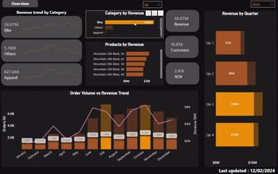

# 🔍 Executive Summary
Adventure Works revenue is driven primarily by high-value bike purchases, with strong seasonal demand patterns and a greater impact from average order value (AOV) than order volume.
---

# 📊 Revenue Analysis Summary

---

## 🔶 1. Revenue Structure

  

### 📊 Key Findings & Insights
Bike category generates **$36.07M (~84%)** of total revenue ($43.11M), with **~10.85K customers** and a high **AOV of $3.12K**.  
→ Revenue is **highly concentrated** and driven by **high-value purchases**, indicating both strong performance and **concentration risk**.

### 📌 Recommendation
- Diversify revenue via **Accessories / Apparel bundling**  
- Focus on **premium bike segments** to sustain AOV  
- Retain **high-value customers** through loyalty programs  

---

## 🔷 2. Time Dimension (Seasonality)

  

### 📊 Key Findings & Insights
Revenue peaks in **Q3 ($13M+) and Q4 ($14M+)** , with spikes in **July and October**.  
→ Indicates **strong seasonality** and **promotion/peak-driven demand**.

### 📌 Recommendation
- Align inventory with **Q3–Q4 demand peaks**  
- Run major campaigns in **July & October**  
- Use off-season for **discount & demand stimulation**  

---

## 🔸 3. Revenue Drivers (Volume vs Value)

  

### 📊 Key Findings & Insights
Revenue peaks (~$5M) while order volume fluctuates (~2K–6K). Some months maintain revenue despite lower volume.  
→ **AOV is a key driver**, not just order volume.

### 📌 Recommendation
- Increase AOV via **upselling & bundling**  
- Promote **high-margin products**  
- Target **high-spending customers**  

---

## 📌 Key Takeaways
- Revenue is heavily dependent on the **Bike category**, creating both strength and risk  
- **High AOV ($3.12K)** indicates premium purchasing behavior  
- **Strong seasonality (Q3–Q4)** highlights the importance of timing  
- Revenue is driven more by **customer value (AOV)** than by order volume

## 📌 Dashboard
- 
